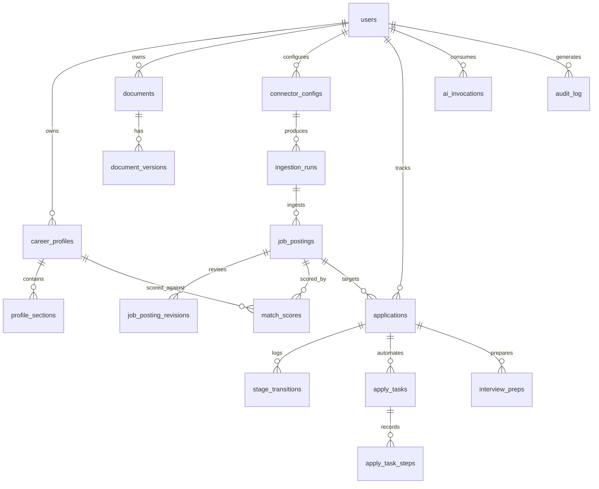

# CareerPilot AI — Database Design

**Version:** 0.1 | **Status:** PROPOSED | PostgreSQL 16 + pgvector, Drizzle migrations

Design rules: UUIDv7 PKs (time-ordered); `created_at/updated_at` everywhere; soft delete only where product requires undo (documents); append-only tables never updated; all JSONB columns have a Zod schema and a documented version field.

---

## 1. Entity-Relationship Overview

## 2. Core Tables

### users
| column | type | notes |
|---|---|---|
| id | uuid pk | |
| email | citext unique | |
| password_hash | text | argon2id; null if OIDC-only |
| role | enum(owner, member) | self-host usually one owner |
| settings | jsonb | UI prefs, notification prefs (schema v1) |

### career_profiles
| id uuid pk | user_id fk | title text | summary text | is_active bool |
| embedding vector(1024) | recomputed on profile change |
| facts_hash text | hash of canonical facts, used to invalidate tailored docs |

### profile_sections
Structured content, one row per entry (experience, education, project, skill-group, certification).
| id | profile_id fk | kind enum | sort int | content jsonb (versioned schema per kind) |
| content_text text | flattened text for FTS + embedding source |

Rationale: JSONB-per-entry over fully normalized columns — section schemas evolve fast; queries are by profile, not by field. FTS via generated tsvector on `content_text`.

### documents / document_versions
| documents: id, user_id, kind enum(resume, cover_letter, other), title, current_version_id, deleted_at |
| document_versions: id, document_id fk, version int, source enum(imported, generated, edited), content jsonb (structured doc model), rendered_pdf_key text, generation_job_id fk null, profile_facts_hash text, created_at |

Invariant: versions append-only. `profile_facts_hash` lets UI flag documents stale relative to profile.

### connector_configs
| id | user_id | connector_key text (e.g. `greenhouse`, `rss`, `usajobs`) | display_name | enabled bool | schedule_cron text | config jsonb | credentials_ref text | health enum(healthy, degraded, disabled) | last_success_at |

`credentials_ref` points into the secrets store (never plaintext creds in DB — see Security Model §4).

### ingestion_runs
Append-only. | id | connector_config_id | started_at | finished_at | status enum(running, ok, partial, failed) | stats jsonb (fetched, deduped, inserted) | error text |

### job_postings
| id | source_connector_key | external_id text | url text | url_hash text | company text | title text | location jsonb | remote enum | salary jsonb | description_md text | posted_at | ingested_at | status enum(active, closed, expired) | embedding vector(1024) | dedup_group_id uuid |

Indexes: unique (source_connector_key, external_id); `url_hash` btree; HNSW on embedding; GIN tsvector on (title, company, description).
Dedup: exact via url_hash; fuzzy via embedding similarity + trigram on title+company → shared `dedup_group_id`.

### match_scores
| id | job_posting_id | profile_id | overall smallint 0–100 | components jsonb ({skills, seniority, domain, location, compensation}) | explanation_md text | method enum(embedding_only, rubric_llm) | model text | created_at |
Unique (job_posting_id, profile_id, method). Recompute allowed → new row, latest wins by created_at.

### applications
| id | user_id | job_posting_id | stage enum(discovered, interested, applied, screening, interview, offer, rejected, withdrawn) | resume_version_id fk | cover_letter_version_id fk | applied_at | notes_md | metadata jsonb |

### stage_transitions (append-only)
| id | application_id | from_stage | to_stage | actor enum(user, system, agent) | reason text | created_at |

### apply_tasks / apply_task_steps
| apply_tasks: id, application_id, state enum(draft, mapping, awaiting_review, approved, submitting, submitted, failed, aborted), target_url, field_mapping jsonb, approval_token uuid null, approval_consumed_at, error |
| apply_task_steps (append-only): id, apply_task_id, seq, action enum(navigate, fill, upload, screenshot, pause, submit), payload jsonb (redacted), screenshot_key text, at |

Invariant enforced in domain + a partial unique index: `approval_consumed_at` can be set at most once; submission requires unconsumed token.

### ai_invocations (append-only)
| id | user_id | context enum(matching, tailoring, interview, agent, parsing) | ref_id uuid | provider | model | prompt_tokens int | completion_tokens int | cost_usd numeric(10,6) | latency_ms | status | error | created_at |
Monthly budget check = sum over current month, enforced pre-dispatch with cached counter in Redis, reconciled from this table.

### audit_log (append-only)
| id | user_id | action text | subject_type | subject_id | ip | user_agent | detail jsonb (PII-redacted) | created_at |
Written for: auth events, credential changes, connector enable/disable, apply-task approval/submit, exports, MCP tool calls.

### interview_preps
| id | application_id | kind enum(questions, mock_session, company_brief) | content jsonb | created_at |

## 3. Migrations & Data Lifecycle

- Drizzle SQL migrations, forward-only, CI-gated (`drizzle-kit check` + migrate against ephemeral PG in tests).
- Retention: job_postings pruned when `closed` > 180 days and no application references; ai_invocations kept 24 months (cost history); audit_log never pruned in v1.
- Backups: `pg_dump` cron in compose stack + documented restore drill.

## 4. Rejected alternatives

- **SQLite** for simpler self-host: rejected — pgvector, concurrent workers, and FTS needs make PG worth the container.
- **Separate vector DB (Qdrant)**: rejected for v1 (ADR-002); revisit > 1M postings.
- **Event sourcing for Application aggregate**: over-engineering; append-only transition log gives the audit benefit without projection machinery.
