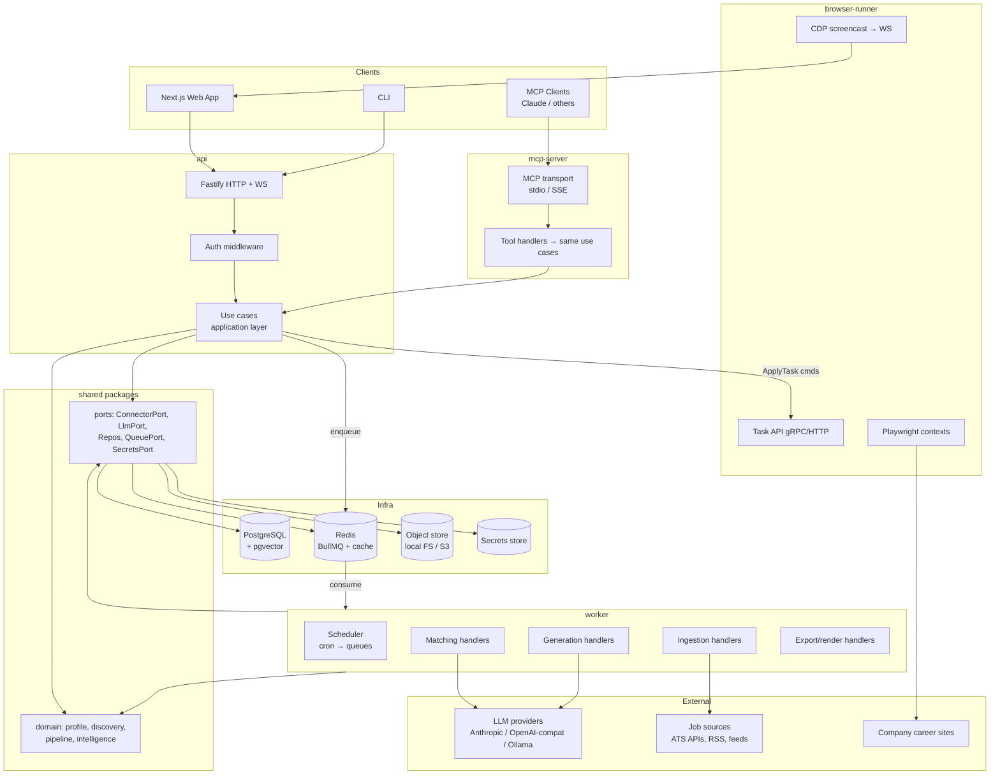
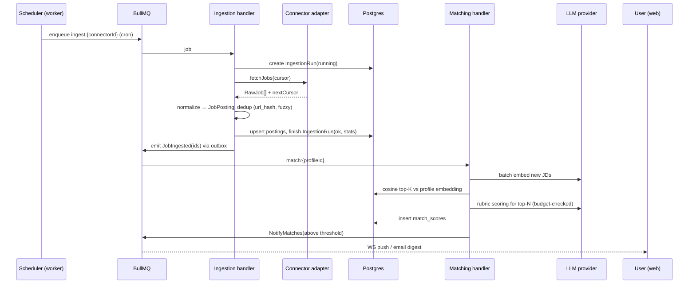
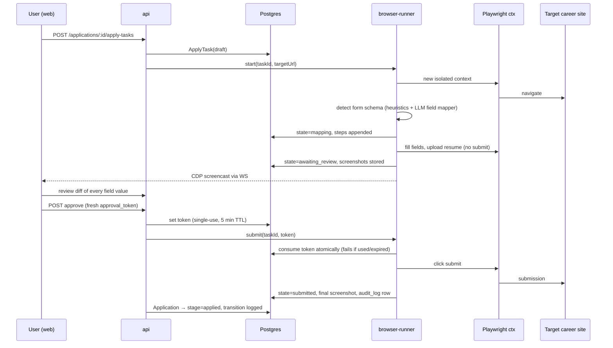
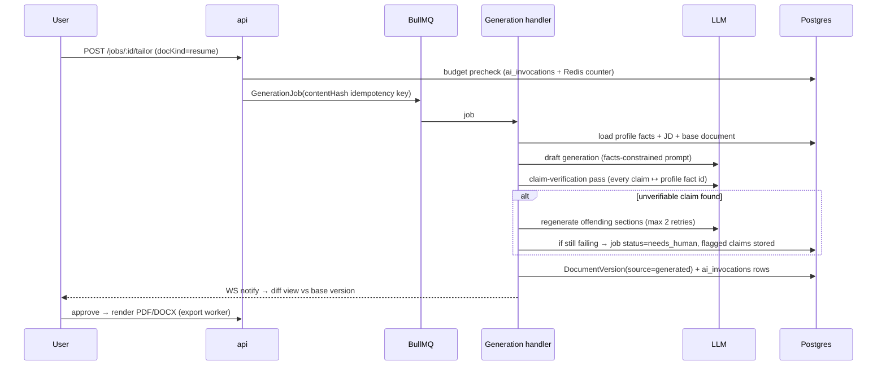

# CareerPilot AI — Component & Sequence Diagrams

**Version:** 0.1 | **Status:** PROPOSED

## 1. Component Diagram

## 2. Sequence: Job Ingestion → Match → Notification

## 3. Sequence: Assisted Apply (human-in-the-loop, exactly-once submit)

## 4. Sequence: Tailored Resume Generation with Claim Verification

